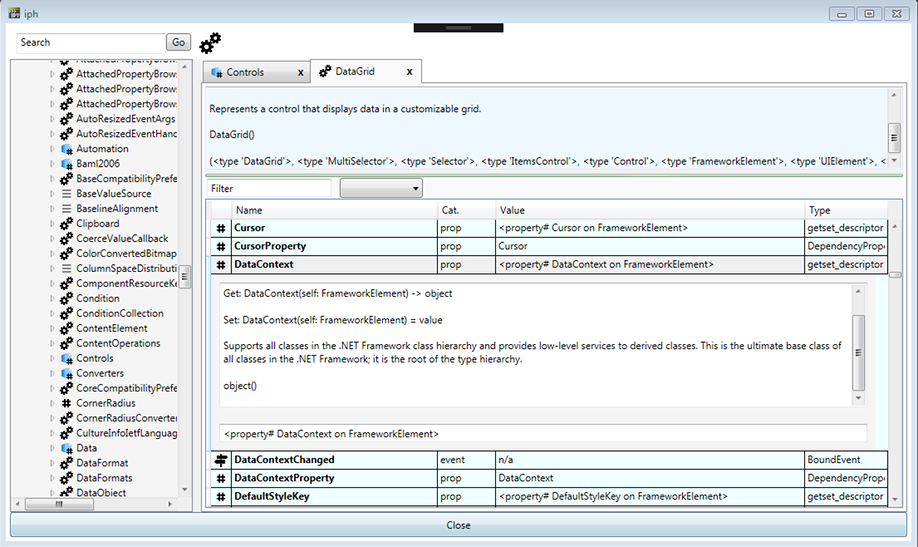
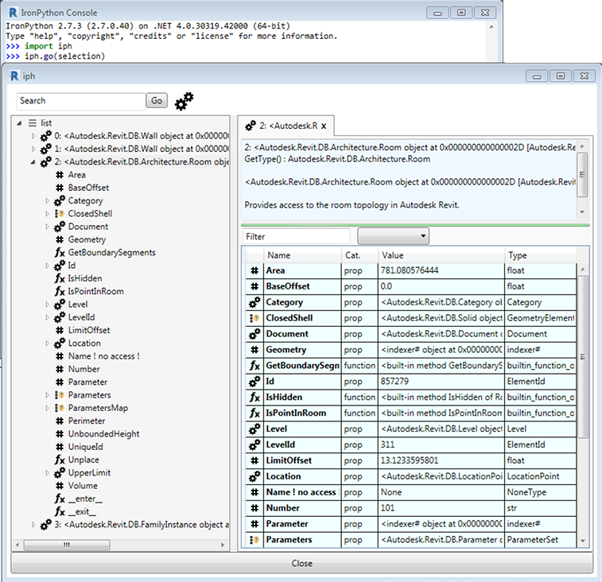
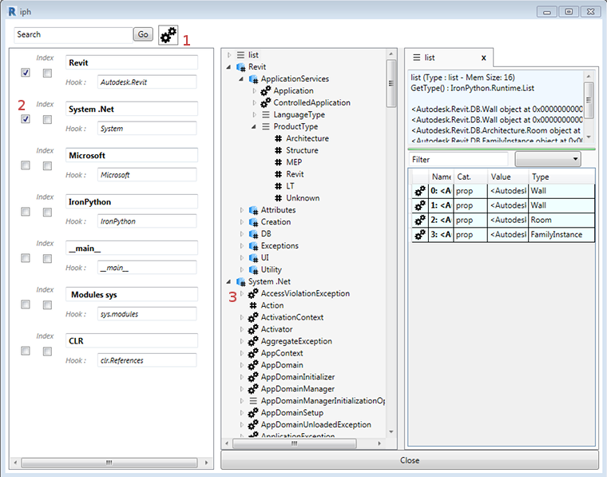

# iph - Ironic Python Helper

Half lookup, half doc reader, half visual debugger, these 3 halves are helpfull 
when you're dealing with huge .NET frameworks or Python modules.

In few words, iph extracts doc and also provides a visual representation of any object called in a Python script.

You can apply this to :
- __Read APIs doc like a .chm reader:__ 
  - It extracts internal doc of all classes and attributes
  - It offers an offline access to doc (faster ?)
  - It allows to focus/sort/filter specific names easily
  


- __Get Objects informations in the context of a running application like Revit:__

  - Really helpfull if you have access to a shell/console (or by pluging the launcher to any macro)
  - Direct access to doc, plus it displays values of attributes



- __Debug or Flesh out any object/class in a script:__

  - It replaces usual logs with print()
  - It displays much more details with one call
  - It allows to access related classes/attributes
 
  _Debug mode in progress, i want to provide two ways : breakpoints and snapshots_ 
  - _breakpoints pause the current script til window is closed_
  - _snapshots let the script run, and save/gather logged objects as tabs_


- __Change the API targets easily :__

   - Enable existing target to display the base node in treeview
   - You can replace targets with any module (read from sys.modules or try an import)


This module is written with IronPython which supports many DLL on windows, especially WPF, Winforms or Revit API.
I used them a lot to build and test this tool itself.

### WARNING 

The module is not ready yet, it runs quite well, 
but not enough to create an installer or add the tag _beta version_.

I wonder if the approach is safe, it only reads the references, i'm not aware of any risk involved.

I try to make this app display no lies about class members and details, the main approach may be too basic for your needs,
please report anything going wrong. 

I'm sorry if the present code offends you or anybody, warn me if you loose an eye.

# Setup & Usage


### Standalone 

  - ironpython must be installed
  - copy the folder in a directory known by sys.path (default C:\Program Files (x86)\IronPython 2.7\Lib)
  - launch the app with the Ironpython shell 

```python
import iph
iph.go()  # launch the reader

iph.go(any_object_in_a_script) # direct inspection 

```
  - or copy the folder anywhere and use the launcher.py file :
  
    --> right-click  > open with > ironpythonconsole


### In Revit
Setup is easy inside RevitPythonShell or PyRevit :
  - RPS :
    - just copy the main folder in a directory known by RPS
    - default path : ..AppData\Roaming\RevitPythonShell201*
    - then call it from the REPL or create a button in toolbar (external file)
    
  ```python
import iph
iph.go()  # launch the reader

iph.go(doc) # analyses Document class

iph.go(selection) # analyses selected elements

iph.go(__revit__) # analyses Application class
``` 
  - PyRevit : 
    - clean way in progress
    


### Debug/ Snapshots Mode

  - ironpython must be installed
  - copy the folder in a directory known by sys.path (default C:\Program Files (x86)\IronPython 2.7\Lib)
  - or copy the folder in your python project, or next to your script
  - use the following commands to trigger snapshots 
 
_breakpoint mode can be used with iph.go() but it's oneshot for now_
    
```python
import iph

iph.snap(var_before) # init the tracer and snapshot before code exec

# [...code running...]

iph.snap(var_halfway)

# [...code running...]

iph.snap(var_after) # snapshot after code exec

iph.go() # display results at the end


# short way:
import iph
iph.snap(var_before)
iph.go(var_after)
```


# TIPS

- Use keyboard to focus nodes in the tree (first letter)

- Filter the rows in datagrid, or change the template to display all members

- The tree displays filtered members by default, select a node and change filter in the datagrid to display all members

- An index engine is available for autocompletion, still in work but it's quite effective.
Please avoid this function on python modules, brakes are broken!

- Analysis and output details are based on templates, so it's easy to add new types/behaviors for more accuracy.

- if you want to test the debug mode to contribute :
  - launch iph with iph.debug() to activate the logger
  - press F10 on some selected controls to display details
  - unit tests are quite basic for now, but it helps to spot basic functionnal bugs.
  
# NOTES  
I tried WPF with this project and finally it helped me __a lot__ to 
understand bindings and relationship between the several classes, and also spot some convenient attributes (like DataContext on every controls)
Did i understand wpf the right way ? The question remains. 

I really need some feedback about the main pattern or how i could improve stability.

All of this works thanks to IronPython reflexion.
Iph only holds this mirror to inspect objects, 
you'll obtain _basically_ the same informations with a dir()/getattr loop in a console.

The IronPython layer is sugar, 
but some limitations force to work around the base concept. 
I won't bore you with the Allegory of the Cave but it's quite the same, what you see is not really what you get.

Also, some functions are leaky with huge objects (or it's the whole pattern ?) so i started to dig into gc.collect.
My new favorite passion is looking at perf charts falling down!
Any comment is welcome to help me spot these weaknesses.

Any contribution is welcome by the way.

## Many Thanks to:
- [IronPython Team](https://github.com/IronLanguages)
- [Gui Talarico ](https://github.com/gtalarico) for the tool [RPW](https://github.com/gtalarico/revitpythonwrapper)
- [Daren Thomas](https://github.com/daren-thomas) for the tool [RPS](https://github.com/architecture-building-systems/revitpythonshell)
- [Ehsan Iran-Nejad](https://github.com/eirannejad) for the tool [PyRevit](http://eirannejad.github.io/pyRevit/)
- [Icon8](https://icons8.com/) : some icons come from their collection
